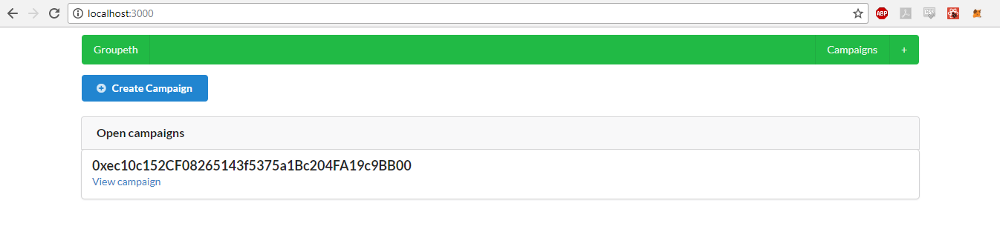

 


# Groupeth
Decentralized Crowd campaign app running on **Rinkeby** test net.  Made using React,Next.js,Solidity and Semantic-UI.



## Quick Installation
```javascript
npm install
yarn run dev
```

## Custom Installation
To run with your own Contract address
```javascript
cd .. ethereum
node compile.js
node deploy.js
```


Replace this line with your contract address from console.log
```javascript
(JSON.parse(CampaignFactory.interface),{contract_address_here});
```
Then run
```javascript
yarn run dev
```
